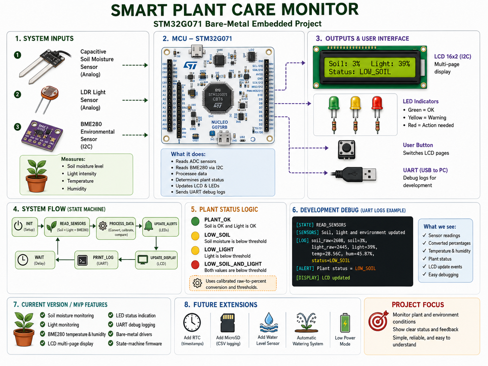

# STM32 Smart Plant Care Monitor

This repository contains a bare-metal embedded project for the **STM32G071RB** microcontroller, developed as part of my embedded systems learning process.

The goal of this project is to practice low-level embedded C development by building a complete sensor-based application using custom peripheral drivers, real hardware modules, and a simple state-machine based firmware architecture.

The system monitors plant and environment conditions, processes the sensor data, and provides feedback using an LCD, LEDs, and UART debug logs.

## Target Hardware

* **Board:** NUCLEO-G071RB
* **MCU:** STM32G071RBTx
* **Core:** Arm Cortex-M0+
* **IDE:** STM32CubeIDE
* **Language:** C

Additional modules used in this project:

* Capacitive soil moisture sensor
* LDR light sensor
* BME280 temperature and humidity sensor
* 16x2 I2C LCD module
* Red, yellow, and green status LEDs
* Onboard user button
* UART debug output through ST-LINK Virtual COM Port

## Repository Structure

```text
STM32_Smart_Plant_Monitor/
├── Firmware/
│   ├── Drivers/
│   │   ├── Custom/
│   │   │   ├── Inc/        # Custom STM32G071 peripheral driver headers
│   │   │   └── Src/        # Custom STM32G071 peripheral driver source files
│   │   └── Components/
│   │       ├── LCD_I2C/    # 16x2 I2C LCD component driver
│   │       └── BME280/     # BME280 environmental sensor component driver
│   ├── Inc/                # Application headers
│   └── Src/                # Application source files
├── Images/                 # Project diagrams and documentation images
└── README.md
```

## Implemented Drivers and Modules

The project uses custom bare-metal drivers and component drivers, including:

* GPIO driver
* ADC driver
* I2C driver
* USART driver
* 16x2 I2C LCD component driver
* BME280 component driver

The code is written specifically for the STM32G071 register layout and is not based on HAL.

## Current Features

The current version includes:

* Soil moisture monitoring using ADC
* Light level monitoring using ADC
* Temperature and humidity monitoring using BME280 over I2C
* Multi-page LCD user interface
* LED-based plant status indication
* UART debug logging
* Onboard user button for switching LCD pages
* Sensor calibration and raw-to-percent conversion
* State-machine based application flow

## LCD User Interface

The 16x2 LCD displays live system data across multiple pages.

Current LCD pages:

* Soil moisture and light level
* Plant status message
* Temperature and humidity from the BME280 sensor

The onboard user button is used to switch between the LCD pages.

## Plant Status Logic

The application calculates the plant status based on calibrated sensor thresholds.

Current plant states:

* `OK`
* `LOW_SOIL`
* `LOW_LIGHT`
* `LOW_SOIL_AND_LIGHT`
* `SENSOR_ERROR`

The status is shown using:

* LCD text messages
* LED indicators
* UART debug logs

LED behavior:

* Green LED: plant status is OK
* Yellow LED: warning condition
* Red LED: action needed or sensor error

## Application State Machine

The main application is organized as a simple state machine:

```text
INIT
  ↓
READ_SENSORS
  ↓
PROCESS_DATA
  ↓
UPDATE_ALERTS
  ↓
UPDATE_DISPLAY
  ↓
PRINT_LOG
  ↓
WAIT
  ↓
READ_SENSORS
```

This structure keeps the application logic clear and makes it easier to extend the project with additional features.

## UART Debug Example

Example UART output:

```text
[STATE] READ_SENSORS
[SENSORS] Soil, light and environment updated
[STATE] PROCESS_DATA
[PROCESS] Plant status updated
[STATE] UPDATE_ALERTS
[ALERT] Plant status = LOW_SOIL
[STATE] UPDATE_DISPLAY
[DISPLAY] LCD updated
[STATE] PRINT_LOG
[LOG] soil_raw=2608, soil=3%, light_raw=2445, light=39%, temp=28.56C, hum=45.87%, status=LOW_SOIL
[STATE] WAIT
[WAIT] Waiting before next measurement cycle
```

## Project Diagram

The following diagram shows the high-level system architecture, including sensor inputs, STM32G071 processing, user interface outputs, UART debug logs, and planned future extensions.



## Current Project Status

Working MVP completed.

The project currently includes a complete sensor-to-output flow:

```text
Sensors → STM32G071 processing → LCD / LEDs / UART logs
```

The firmware reads sensor values, converts raw readings into meaningful data, determines the plant status, updates the user interface, and prints debug information.

## Planned Future Improvements

Planned future extensions include:

* RTC timestamp support
* MicroSD CSV data logging
* Water level monitoring
* Timer-based scheduling instead of blocking delay
* EXTI interrupt support for the user button with debounce
* Low-power mode
* Automatic watering support
* Additional documentation with wiring photos and demo video

## Notes

This repository is intended for learning and portfolio purposes.

The project focuses on practical embedded systems development, including low-level peripheral usage, custom driver integration, sensor communication, application structure, and debugging on real hardware.

Some parts of the system are intentionally kept simple in order to make the firmware easy to understand, test, and extend.
