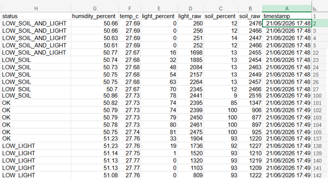

# STM32 Smart Plant Care Monitor

This repository contains a bare-metal embedded systems project for the **STM32G071RB** microcontroller.

The project was developed as part of my embedded systems learning process, with the goal of building a complete sensor-based application using custom peripheral drivers, real hardware modules, and a simple state-machine based firmware architecture.

The system monitors plant and environmental conditions, processes the sensor data, displays live information on an LCD, controls status LEDs, prints UART debug logs, and saves timestamped measurements to a MicroSD card as a CSV file.

## Project Overview

The Smart Plant Care Monitor measures:

* Soil moisture
* Light level
* Ambient temperature
* Ambient air humidity

Based on calibrated thresholds, the firmware determines the current plant status:

* `OK`
* `LOW_SOIL`
* `LOW_LIGHT`
* `LOW_SOIL_AND_LIGHT`
* `SENSOR_ERROR`

The result is shown using:

* A multi-page 16x2 LCD interface
* Red, yellow, and green status LEDs
* UART debug logs
* Timestamped CSV logging to a MicroSD card

## Why This Project

The main technical goal of this project was to practice using the custom STM32G071 peripheral drivers I implemented myself, including GPIO, ADC, I2C, SPI, and USART.

At the same time, I wanted to build something practical and personal. Since I grow plants at home, I thought it would be interesting to create a small embedded system that helps monitor plant conditions and makes it easier to know whether a plant needs more water or more light.

This made the project more meaningful because it combines low-level embedded C development with a real-world use case.

## Target Hardware

* **Board:** NUCLEO-G071RB
* **MCU:** STM32G071RBTx
* **Core:** Arm Cortex-M0+
* **IDE:** STM32CubeIDE
* **Language:** C

## Hardware Modules

Additional modules used in this project:

* Capacitive soil moisture sensor
* LDR light sensor
* BME280 temperature and humidity sensor
* DS3231 real-time clock module
* 16x2 I2C LCD module
* MicroSD card module over SPI
* Red, yellow, and green status LEDs
* Onboard user button
* UART debug output through ST-LINK Virtual COM Port

## Repository Structure

```text
STM32_Smart_Plant_Monitor/
├── Firmware/
│   ├── Drivers/
│   │   ├── Custom/
│   │   │   ├── Inc/        # Custom STM32G071 peripheral driver headers
│   │   │   └── Src/        # Custom STM32G071 peripheral driver source files
│   │   └── Components/
│   │       ├── LCD_I2C/    # 16x2 I2C LCD component driver
│   │       ├── BME280/     # BME280 environmental sensor component driver
│   │       ├── DS3231/     # DS3231 RTC component driver
│   │       └── MicroSD/    # MicroSD card component driver
│   ├── Middlewares/
│   │   └── FatFs/          # FatFs filesystem middleware
│   ├── Inc/                # Application headers
│   └── Src/                # Application source files
├── Docs/                   # Example CSV log generated by the firmware
├── Images/                 # Project diagrams, screenshots, and documentation images
└── README.md
```

## Implemented Drivers and Modules

The project uses custom bare-metal drivers and component drivers, including:

* GPIO driver
* ADC driver
* I2C driver
* SPI driver
* USART driver
* 16x2 I2C LCD component driver
* BME280 component driver
* DS3231 RTC component driver
* MicroSD card component driver
* FatFs disk I/O glue layer

The code is written specifically for the STM32G071 register layout and is not based on HAL.

## Features

The completed version includes:

* Soil moisture monitoring using ADC
* Light level monitoring using ADC
* Temperature and humidity monitoring using BME280 over I2C
* Real-time timestamp support using DS3231 over I2C
* MicroSD card initialization over SPI
* CSV data logging using FatFs
* Multi-page LCD user interface
* LED-based plant status indication
* UART debug logging through ST-LINK Virtual COM Port
* Onboard user button for switching LCD pages
* Sensor calibration and raw-to-percent conversion
* State-machine based application flow

## Why Temperature and Humidity Are Monitored

The BME280 sensor is used to monitor the plant's surrounding environment.

Temperature and air humidity are useful because plant health is affected not only by the amount of water in the soil, but also by the surrounding conditions. High temperature can cause soil to dry faster, low humidity can increase water loss from the plant, and unusual temperature or humidity values can help explain changes in soil moisture over time.

For example:

```text
High temperature + low humidity  → soil may dry faster
Normal soil moisture + low light → plant may need better light exposure
Soil moisture trend over time    → easier to understand with timestamped environment data
```

In this project, temperature and humidity are displayed on the LCD, printed in UART logs, and saved to the CSV file together with the timestamp, soil moisture, light level, and plant status.

## LCD User Interface

The 16x2 LCD displays live system data across multiple pages.

LCD pages:

* Soil moisture and light level
* Temperature and humidity from the BME280 sensor
* Plant status message

The onboard user button is used to switch between LCD pages.

## Plant Status Logic

The application calculates the plant status based on calibrated sensor thresholds.

Plant states:

* `OK`
* `LOW_SOIL`
* `LOW_LIGHT`
* `LOW_SOIL_AND_LIGHT`
* `SENSOR_ERROR`

LED behavior:

* Green LED: plant status is OK
* Yellow LED: warning condition, such as low soil moisture or low light
* Red LED: action needed, combined warning condition, or sensor error

## Application State Machine

The main application is organized as a simple state machine:

```text
INIT
  ↓
READ_SENSORS
  ↓
PROCESS_DATA
  ↓
UPDATE_ALERTS
  ↓
UPDATE_DISPLAY
  ↓
PRINT_LOG
  ↓
WAIT
  ↓
READ_SENSORS
```

This structure keeps the application logic clear and makes it easier to extend the firmware with additional features.

## UART Debug Example

Example UART output:

```text
[STATE] READ_SENSORS
[SENSORS] Soil, light and environment updated
[STATE] PROCESS_DATA
[PROCESS] Plant status updated
[STATE] UPDATE_ALERTS
[ALERT] Plant status = LOW_SOIL
[STATE] UPDATE_DISPLAY
[DISPLAY] LCD updated
[STATE] PRINT_LOG
[LOG] 2026-06-21 17:48:08, soil_raw=2608, soil=8%, light_raw=1500, light=0%, temp=28.56C, hum=45.87%, status=LOW_SOIL_AND_LIGHT
[FS] Plant data logged to CSV
[STATE] WAIT
[WAIT] Waiting before next measurement cycle
```

## CSV Data Logging

The firmware logs plant measurements to a MicroSD card as a CSV file.

The CSV file includes:

```text
timestamp,soil_raw,soil_percent,light_raw,light_percent,temp_c,humidity_percent,status
```

Example CSV rows:

```text
2026-06-21 17:48:08,2608,8,1500,0,28.56,45.87,LOW_SOIL_AND_LIGHT
2026-06-21 17:48:18,2601,9,2210,56,28.62,45.73,LOW_SOIL
2026-06-21 17:48:38,1350,83,2250,60,28.64,45.60,OK
2026-06-21 17:49:02,1348,84,1510,1,28.63,45.65,LOW_LIGHT
```

A real CSV log generated by the firmware during the final demo is available here:

[View demo CSV log](Docs/PLANTLOG.CSV)

Example CSV log opened on a computer:



This allows the system behavior to be verified after the demo by opening the generated CSV file on a computer.

## Demo Behavior

During the final demo, the system responds to changing plant and environment conditions:

```text
Dark + dry soil      → LOW_SOIL_AND_LIGHT → Red LED
Window opened        → LOW_SOIL           → Yellow LED
Plant watered        → OK                 → Green LED
Window closed again  → LOW_LIGHT          → Yellow LED
```

This demonstrates that the firmware is not only reading sensors, but also combining multiple inputs into meaningful plant status decisions.

## Project Diagram

The following diagram shows the high-level system architecture, including sensor inputs, STM32G071 processing, user interface outputs, UART debug logs, RTC timestamping, and MicroSD CSV logging.


## Current Project Status

Completed working version.

The project currently includes a complete sensor-to-output-and-storage flow:

```text
Sensors → STM32G071 processing → LCD / LEDs / UART logs → MicroSD CSV logging
```

The firmware reads sensor values, converts raw readings into meaningful data, determines the plant status, updates the user interface, prints debug information, and logs timestamped measurements to a MicroSD card.

## What I Practiced

This project helped me practice:

* Bare-metal embedded C development
* STM32G071 register-level programming
* GPIO, ADC, I2C, SPI, and USART peripheral usage
* Custom driver design
* Sensor integration
* I2C communication with multiple devices on the same bus
* SPI communication with a MicroSD card
* FatFs integration
* RTC-based timestamping
* State-machine based firmware architecture
* Debugging with UART logs
* Testing on real hardware
* Using environmental data to give context to plant condition monitoring

## Possible Future Improvements

Possible future extensions include:

* Timer-based scheduling instead of blocking delay
* EXTI interrupt support for the user button with debounce
* Low-power mode
* Automatic watering support
* Water level monitoring
* More detailed error handling for sensor and storage failures
* Additional demo video and wiring documentation

## Notes

This repository is intended for learning and portfolio purposes.

The project focuses on practical embedded systems development, including low-level peripheral usage, custom driver integration, sensor communication, application structure, and debugging on real hardware.

Some parts of the system are intentionally kept simple in order to make the firmware easy to understand, test, and extend.
